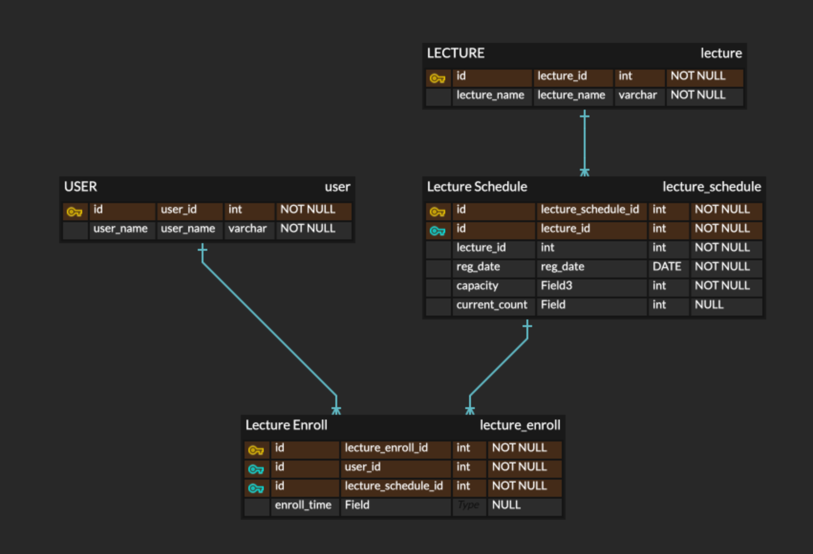

# hhplus-lecture-system
🛳️ Clean Architecture

  

    <b>[ 2주차 과제 ] 📝 특강 신청 서비스</b>
  

## 📌 Description
- `특강 신청 서비스`를 구현해 봅니다.
- 항해 플러스 토요일 특강을 신청할 수 있는 서비스를 개발합니다.
- 특강 신청 및 신청자 목록 관리를 RDBMS를 이용해 관리할 방법을 고민합니다.

## 📌 Requirements
- 아래 2가지 API 를 구현합니다.
- 특강 신청 API
- 특강 신청 여부 조회 API
- 각 기능 및 제약 사항에 대해 단위 테스트를 반드시 하나 이상 작성하도록 합니다.
- 다수의 인스턴스로 어플리케이션이 동작하더라도 기능에 문제가 없도록 작성하도록 합니다.
- 동시성 이슈를 고려 하여 구현합니다.

## 📌 API Specs

**🔥 (핵심)** 특강 신청 **API**

- 특정 userId 로 선착순으로 제공되는 특강을 신청하는 API 를 작성합니다.
- 동일한 신청자는 동일한 강의에 대해서 한 번의 수강 신청만 성공할 수 있습니다.
- 특강은 선착순 30명만 신청 가능합니다.
- 이미 신청자가 30명이 초과되면 이후 신청자는 요청을 실패합니다.

**특강 선택 API**

- 날짜별로 현재 신청 가능한 특강 목록을 조회하는 API 를 작성합니다.
- 특강의 정원은 30명으로 고정이며, 사용자는 각 특강에 신청하기전 목록을 조회해볼 수 있어야 합니다.

**특강 신청 완료 목록 조회 API**

- 특정 userId 로 신청 완료된 특강 목록을 조회하는 API 를 작성합니다.
- 각 항목은 특강 ID 및 이름, 강연자 정보를 담고 있어야 합니다.

>💡 **KEY POINT**

- 정확하게 30 명의 사용자에게만 특강을 제공할 방법을 고민해 봅니다.
- 같은 사용자에게 여러 번의 특강 슬롯이 제공되지 않도록 제한할 방법을 고민해 봅니다.

  

    <b>[ 2주차 과제 ] 📝 TODO </b>
  

### ️📌 **`Default`**

- [x] 아키텍처 준수를 위한 애플리케이션 패키지 설계
- [x] 특강 도메인 테이블 설계 및 목록/신청 등 기본 기능 구현
- [x] 각 기능에 대한 **단위 테스트** 작성

### 📌 **`STEP 3`**
- [x] 설계한 테이블에 대한 ERD 작성
- [x] 작성한 ERD 이유를 설명하는 **README** 작성 
- [ ] 선착순 30명 이후의 신청자의 경우 실패하도록 개선
- [ ] 동시에 동일한 특강에 대해 40명이 신청했을 때, 30명만 성공하는 것을 검증하는 **통합 테스트** 작성

### 📌 **`STEP 4`**
- [ ] 같은 사용자가 동일한 특강에 대해 신청 성공하지 못하도록 개선
- [ ] 동일한 유저 정보로 같은 특강을 5번 신청했을 때, 1번만 성공하는 것을 검증하는 **통합 테스트** 작성

  

    <b> 📝 API 명세서 </b>
  

| 기능             | Method | API URL                       |
|----------------|-------|-------------------------------|
| ⭐️ 특강 신청       | `POST` | /lecture/{lectureId}/register |
| 날짜별 특강 목록      | `GET` | /lecture?date={date}          |
| ⭐️ 특강 신청 완료 조회 | `GET` | /lecture/{userId}/lectures       |

# STEP 1 강의 신청 시스템 ERD

## ERD

## 1. 개요
 사용자가 다양한 강의 일정에 등록할 수 있도록 하며, 각 강의의 수용 인원과 신청 정보를 관리할 수 있도록 설계했습니다.
ERD는 다음과 같은 테이블로 구성되어 있습니다

- User (사용자)
- Lecture (강의)
- Lecture Schedule (강의 일정)
- Lecture Enroll (강의 신청)
- 각 엔터티와 그 관계는 데이터 무결성, 효율적인 조회, 확장성을 고려하여 구조화되었습니다.
## 2. 엔티티 설명
### 📌 사용자 테이블 (user)
시스템에서 사용자의 기본 정보를 저장합니다. 각 사용자는 여러 강의 일정에 등록할 수 있습니다.

- user_id: 사용자를 고유하게 식별하는 기본 키입니다.
- user_name: 사용자의 이름으로, 식별 또는 표시 목적으로 사용됩니다.

User와 Lecture Enroll 테이블 간의 관계는 1대 다 관계로, 한 명의 사용자가 여러 강의 일정에 신청할 수 있습니다.

### 📌 강의 테이블 (lecture)
시스템에서 제공되는 강의에 대한 정보를 저장합니다.

- lecture_id: 강의를 고유하게 식별하는 기본 키입니다.
- lecture_name: 강의의 이름입니다.

Lecture와 Lecture Schedule 테이블 간의 관계는 1대 다 관계입니다. 하나의 강의는 여러 일정(예: 동일한 강의가 다른 시간대에 제공됨)을 가질 수 있습니다.

### 📌 강의 일정 테이블 (lecture_schedule)
각 강의의 일정을 저장하며, 일정별로 수용 인원과 현재 신청된 인원 수를 관리합니다.

- lecture_schedule_id: 강의 일정을 고유하게 식별하는 기본 키입니다. 
- lecture_id: 해당 일정이 어느 강의의 일정인지 나타내는 외래 키입니다. 
- reg_date: 강의 일정이 등록된 날짜 또는 진행 날짜입니다. 
- capacity: 해당 일정에 수용 가능한 최대 인원 수입니다. 
- current_count: 현재 등록된 인원 수를 나타냅니다.

Lecture Schedule은 Lecture와 Lecture Enroll 테이블과 연결되어, 각 강의 일정과 해당 일정에 등록된 사용자를 추적할 수 있도록 합니다.

### 📌 강의 신청 테이블 (lecture_enroll)
사용자가 특정 강의 일정에 등록한 정보를 저장하는 연결 엔티티입니다.

- lecture_enroll_id: 각 강의 신청을 고유하게 식별하는 기본 키입니다.
- user_id: 신청한 사용자를 나타내는 외래 키입니다.
- lecture_schedule_id: 신청된 강의 일정을 나타내는 외래 키입니다.
- enroll_time: 사용자가 강의 일정에 신청한 시간을 기록합니다.

이 테이블은 각 사용자가 특정 강의 일정에 대한 신청 기록을 남기며, 중복 신청을 방지하는 역할을 합니다.

## 3. 주요 관계 및 설계 이유
### 📌 사용자 & 강의 신청
사용자가 여러 강의 일정에 등록할 수 있도록 설계되었습니다.

이는 사용자와 강의 신청 테이블 간의 1대 다 관계로 구현되었습니다. 

즉, 한 명의 사용자가 여러 강의 일정에 신청할 수 있지만, 각 신청은 특정한 강의 일정에만 해당됩니다.

### 📌 강의 & 강의 일정
하나의 강의는 여러 일정(예: 같은 강의가 다른 날짜에 제공될 수 있음)을 가질 수 있습니다.

이를 통해 강의 일정을 유연하게 관리하고, 사용자가 선택할 수 있는 다양한 시간대를 제공할 수 있습니다.

### 📌 강의 일정 & 강의 신청
강의 일정 테이블은 각 강의 일정의 수용 가능 인원과 현재 신청 인원을 관리합니다.

강의 신청 테이블은 사용자가 이러한 일정에 등록한 정보를 기록합니다. 

현재 신청 인원은 신청이 성공할 때마다 업데이트되어 수용 인원이 초과되지 않도록 관리됩니다.

